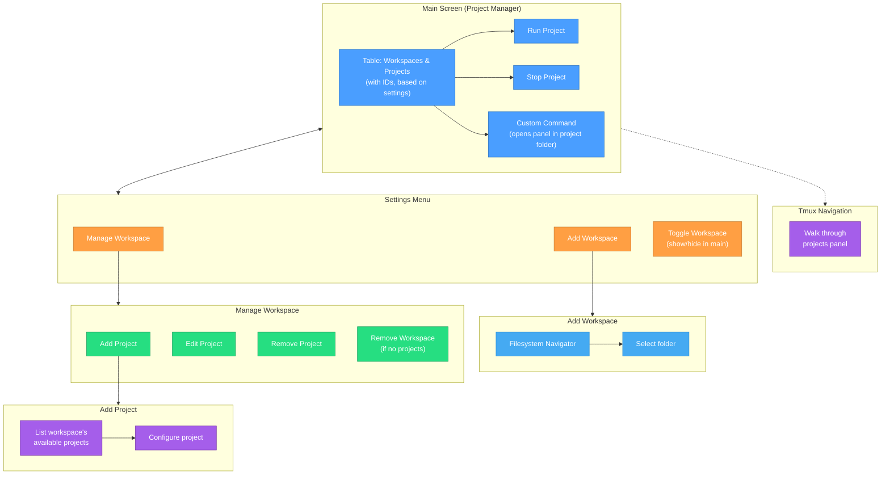

# FM Manager

A powerful terminal-based project manager with tmux integration and workspace organization. FM Manager helps you organize, monitor, and manage multiple projects from a single, intuitive interface.

## ✨ Features

- **🚀 Workspace Management**: Organize projects by location or category
- **📱 Tmux Integration**: Seamless tmux session management with smart pane layouts
- **🎨 Beautiful UI**: Rich terminal interface with colors and responsive layouts
- **⚙️ Interactive Settings**: Add, edit, and manage workspaces and projects
- **🔧 Modular Design**: Clean architecture with reusable components
- **📊 Status Monitoring**: Real-time project status tracking
- **🏠 Flexible Deployment**: Run locally for development or install system-wide

## 📋 Requirements

### System Dependencies
- **bash** (4.0+)
- **tmux** (2.0+)
- **jq** (for JSON processing)
- **git** (optional, for version control integration)

### Platform Support
- Arch Linux btw
- for macOS, windows, and other OS I recommend praying

## 🚀 Quick Start

### Run Locally

1. **Clone and setup:**
   ```bash
   git clone <repository-url>
   cd fm-manager
   chmod +x startup.sh
   ```

2. **Install dependencies:**
   ```bash
   # Arch Linux
   sudo pacman -S bash tmux jq
   ```

3. **Run the application:**
   ```bash
   ./startup.sh
   ```

4. **Test individual modules:**
    ```bash
    # Test styles
    source styles/index.sh && styles_loaded

    # Test core modules
    source modules/index.sh && modules_loaded
    ```

## 📁 Project Structure

```
fm-manager/
├── startup.sh          # Entry point
├── config/             # Workspace configs (.json)
├── styles/             # UI, colors, animations
└── modules/            
    ├── config/         # Config file management
    ├── tmux/           # Tmux configuration
    ├── navigator/      # Filesystem navigation
    ├── menu/           # Interactive menus
    └── settings/       # Workspace & project configuration
```



## ⚙️ Configuration

### Workspace System
The application uses a workspace-based configuration system:
- **`.workspaces.json`**: Defines active workspaces and their locations
- **Workspace configs**: Individual JSON files for each workspace's projects

Configuration storage:
- **Local development**: `./config/`
- **System installation**: `~/.cache/fm-manager/`

## 🧪 Testing

For development testing, use the included test environment:

### Generate Mock Projects
```bash
# Generate 2 folders with 3 projects each (total: 6 projects)
./test-area/mockup.sh 2 3

# Generate 2 folders with 5 projects each (total: 10 projects)
./test-area/mockup.sh 2 5

# Clean up test projects
./test-area/mockup.sh clean
```

### Test with Mock Configuration
```bash
# Switch to test configuration (backs up original configs)
./test-area/masquerade.sh enable

# Run fm-manager to test functionality safely
./startup.sh

# Test starting/stopping projects without affecting real ones

# Restore original configuration
./test-area/masquerade.sh restore
```

The masquerade script safely swaps your configs with generated mock workspaces, backing up the originals. Mock projects are simple processes (`echo + sleep 999999`) perfect for testing without interfering with actual projects.

## 🤝 Contributing

1. Clone this and open a Pull Request with a proper branch.
2. Follow the modular architecture principles

### Development Guidelines

- **Single Responsibility**: One module, one purpose
- **Clear Dependencies**: Explicit and minimal
- **Error Handling**: Graceful failure handling
- **Documentation**: Clear function documentation

## 📓 License

This project is licensed under the NIC License.

## 🎉 Credits

Built with ❤️ using claude code CLI, thank god.
