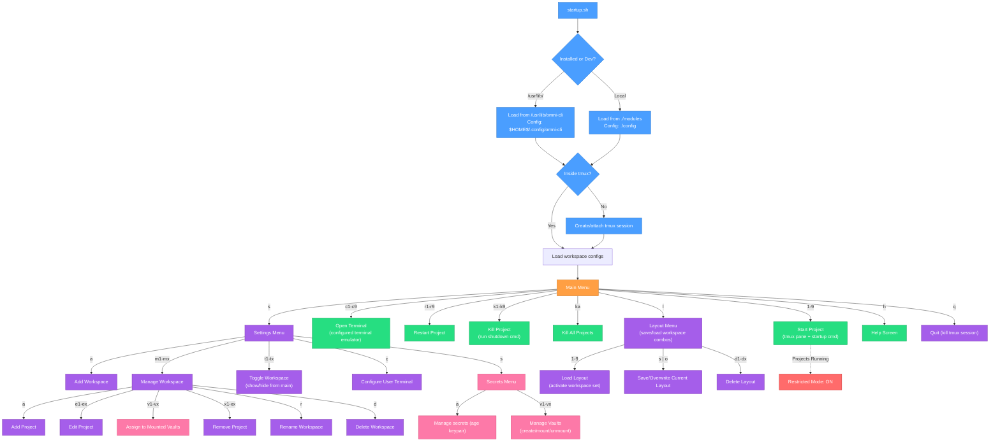

# omni-cli

A powerful terminal-based project manager with tmux integration and workspace organization. omni-cli helps you organize, monitor, and manage multiple projects from a single, intuitive interface.

## ✨ Features

- **🚀 Workspace Management**: Organize projects by location or category
- **📱 Tmux Integration**: Seamless tmux session management with smart pane layouts
- **🎨 Beautiful UI**: Rich terminal interface with colors and responsive layouts
- **⚙️ Interactive Settings**: Add, edit, and manage workspaces and projects
- **🔒 Restricted Mode**: Access settings while projects run (toggle workspaces only)
- **🛡️ Smart Protection**: age + gocryptfs integration for secrets and vaults

## 📋 Requirements

### System Dependencies
- **bash** (4.0+)
- **tmux** (2.0+)
- **jq** (for JSON processing)
- **git** (optional, for version control integration)

### Secrets/Vaults Dependencies
- **age** (for encryption/decryption)
- **gocryptfs** (for encrypted volumes)
- **uuidgen** (for generating unique IDs)

### Platform Support
- Arch Linux btw
- for macOS, windows, and other OS I recommend praying. Or feel free to test it, tweak it and open a PR to the project!

## 🚀 Quick Start

### Run Locally

1. **Clone and setup:**
   ```bash
   git clone <repository-url>
   cd omni-cli
   chmod +x startup.sh
   ```

2. **Install dependencies:**
   ```bash
   # Arch Linux
   sudo pacman -S bash tmux jq
   ```

3. **Run the application:**
   ```bash
   ./startup.sh
   ```

4. **Test individual modules:**
    ```bash
    # Test styles
    source styles/index.sh && styles_loaded

    # Test core modules
    source modules/index.sh && modules_loaded
    ```

## 📁 Project Structure

```
omni-cli/
├── startup.sh              # Entry point & environment detection
├── PKGBUILD                # Arch Linux package build script
├── LICENSE                 # MIT license (software)
├── LICENSE.pkgbuild        # 0BSD license (packaging sources)
├── config/                 # Workspace configs (.json) [dev mode]
├── styles/                 # UI components
│   ├── colors.sh           # Color definitions & themes
│   ├── ui.sh               # UI primitives (headers, separators)
│   └── animations.sh       # Loading spinners & animations
└── modules/
    ├── config/             # Configuration management
    │   ├── json.sh         # Workspace JSON parsing
    │   └── setup.sh        # Config initialization
    ├── tmux/               # Tmux session & pane management
    │   ├── session.sh      # Session lifecycle
    │   ├── pane.sh         # Pane operations
    │   └── project.sh      # Project start/stop/restart
    ├── navigator/          # Interactive filesystem browser
    │   ├── render.sh       # Directory listing & pagination
    │   └── input.sh        # Keyboard navigation
    ├── menu/               # Main menu system
    │   ├── display.sh      # Menu rendering
    │   ├── commands.sh     # Command routing
    │   ├── actions.sh      # Action handlers (start/stop/terminal)
    │   └── layouts/        # Layout save/load/switch
    ├── settings/           # Settings menu system
    │   ├── display.sh      # Settings UI
    │   ├── commands.sh     # Settings command routing
    │   ├── workspaces/     # Workspace management
    │   │   ├── add.sh      # Add workspace (uses navigator)
    │   │   ├── manage.sh   # Workspace edit screen
    │   │   ├── toggle.sh   # Show/hide workspace
    │   │   ├── rename.sh   # Rename workspace
    │   │   └── delete.sh   # Remove workspace
    │   ├── projects/       # Project management
    │   │   ├── add.sh      # Add project to workspace
    │   │   ├── edit.sh     # Edit project config
    │   │   ├── remove.sh   # Remove project
    │   │   └── secure/     # Vault assignment
    │   └── secrets/        # Secret & vault management
    │       ├── menu.sh     # Secrets menu
    │       ├── add.sh      # Add age keypair
    │       ├── storage.sh  # Keypair persistence
    │       └── vaults/     # Vault operations (mount/unmount)
    └── ui/                 # Reusable UI components
        ├── table.sh        # Table rendering
        └── menu.sh         # Menu primitives
```



## 🧪 Testing

For development testing, use the included test environment:

### Generate Mock Projects
```bash
# Generate 2 folders with 3 projects each (total: 6 projects)
./test-area/mockup.sh 2 3

# Generate 2 folders with 5 projects each (total: 10 projects)
./test-area/mockup.sh 2 5

# Clean up test projects
./test-area/mockup.sh clean
```

### Test with Mock Configuration
```bash
# Switch to test configuration (backs up original configs)
./test-area/masquerade.sh enable

# Run omni-cli to test functionality safely
./startup.sh

# Test starting/stopping projects without affecting real ones

# Restore original configuration
./test-area/masquerade.sh restore
```

The masquerade script safely swaps your configs with generated mock workspaces, backing up the originals. Mock projects are simple processes (`echo + sleep 999999`) perfect for testing without interfering with actual projects.

## 🔮 Future Features

- **Debug tools** - build mode indicators, environment diagnostics, verbose logging
- **Sub-packages** - make navigator and vaults/secrets their own packages

## 🤝 Contributing

1. Clone this and open a Pull Request with a proper branch.
2. Follow the modular architecture principles

### Development Guidelines

- **Single Responsibility**: One module, one purpose
- **Clear Dependencies**: Explicit and minimal
- **Error Handling**: Graceful failure handling
- **Documentation**: Clear function documentation

## 📓 License

### Software License

This project's **software** (application code, modules, scripts) is licensed under the **MIT License**. See [LICENSE](LICENSE) for details.

### Packaging License

The **packaging sources** (PKGBUILD, .SRCINFO, install scripts, patches) are licensed under the **0BSD License** (Zero-Clause BSD) as recommended by Arch Linux for package sources. See [LICENSE.pkgbuild](LICENSE.pkgbuild) for details.

This dual-license approach:
- Allows maximum freedom for using/modifying the software (MIT)
- Ensures AUR packaging sources have minimal restrictions (0BSD)
- Makes the package eligible for promotion to official Arch repositories

## 🎉 Credits

Built with ❤️ using claude code CLI, thank god.
